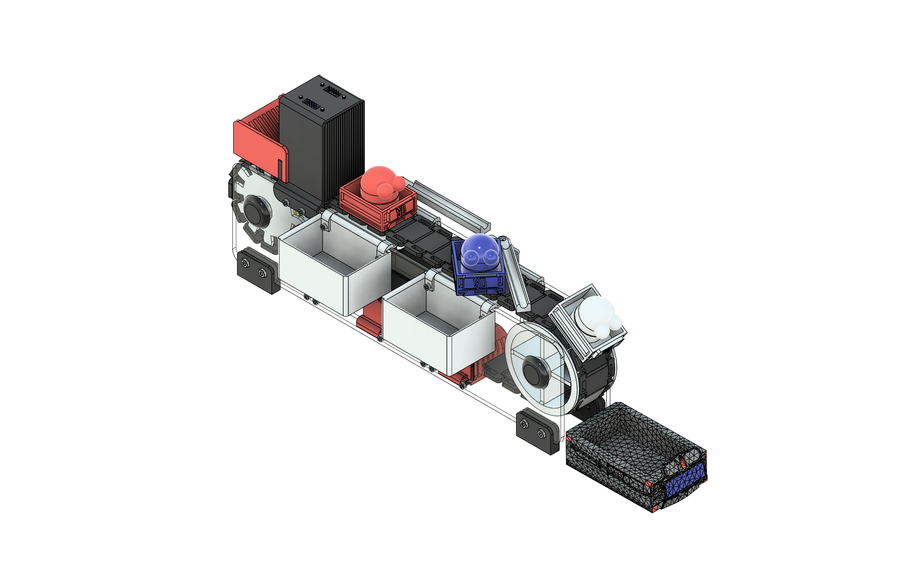

# Conveyor Belt Arduino DIY - Multimedia Gallery 📸🎬

*Author: Fernando Navarrete* ✍️

## English Version 🇺🇸

Welcome to the **Multimedia** directory! 🖼️

This folder serves as the visual documentation hub for the **Sorting Conveyor Belt** project. Here you will find CAD renders, assembly diagrams, and in future updates, real-world photos and videos of the working prototype.

### 📂 Folder Structure

The visual assets are organized by project iteration:

```text
Multimedia
├── 📂 Logos
├── 📂 V1
│   ├── 🖼️ Ensamble Correa Transportadora ISO.png
│   ├── 🖼️ Ensamble Correa Transportadora Oruga Interior.png
│   ├── ... (Other render views)
│   └── 🖼️ Ensamble_ISO_Black_background.png
└── 📝 README.md                    <-- (Documentation) You are here

```

---

### 🏗️ Version 1 (V1) - CAD Design

This section documents the first iteration of the mechanism. The images below represent the **3D Modeling and Rendering** phase, used to validate geometry, mechanical tolerances, and component layout before physical manufacturing.

> **Note:** These images represent the virtual environment. Photos of the physical assembly will be added in a later stage inside a `/Real_Photos` directory.

#### 🌟 Hero View (Studio Render)



#### 📐 Technical Views & Assembly

Below is a gallery of different perspectives of the mechanical design, including isometric, top, and profile views to assist in understanding the structure.


| Isométrica General | Isométrica Alternativa |
| :---: | :---: |
|  |  |

| Vista de Planta (Superior) | Vista Lateral (Perfil) |
| :---: | :---: |
|  |  |

#### ⚙️ Mechanical Detail: Internal Track System

Focus on the internal arrangement of pulleys and transmission.

| Internal Mechanism |
| --- |
|  |

> **⚠️ Mechanical Note on Tolerances:**
> Due to the necessary design clearances (tolerances) in the CAD model, **belt tensioners are not shown in their active operational state** in these renders.
> However, for the physical assembly, tensioners are **mandatory** to ensure proper friction and movement of the belt.

---

## Versión en Español 🇪🇸

*Autor: Fernando Navarrete* ✍️

¡Bienvenido al directorio **Multimedia**! 🖼️

Esta carpeta sirve como el centro de documentación visual para el proyecto de la **Cinta Transportadora Clasificadora**. Aquí encontrarás renders del diseño, diagramas de ensamblaje y, en futuras actualizaciones, fotografías reales y videos del prototipo en funcionamiento.

### 📂 Estructura de Carpetas

Los recursos visuales están organizados por iteración del proyecto:

```text
Multimedia
├── 📂 Logos
├── 📂 V1
│   ├── 🖼️ Ensamble Correa Transportadora ISO.png
│   ├── 🖼️ Ensamble Correa Transportadora Oruga Interior.png
│   ├── ... (Otras vistas renderizadas)
│   └── 🖼️ Ensamble_ISO_Black_background.png
└── 📝 README.md                    <-- (Documentación) Estás aquí

```

---

### 🏗️ Versión 1 (V1) - Diseño CAD

Esta sección documenta la primera iteración del mecanismo. Las imágenes presentadas a continuación corresponden a la fase de **Modelado 3D y Renderizado**, utilizadas para validar la geometría, las tolerancias mecánicas y la disposición de componentes antes de la manufactura física.

> **Nota:** Estas imágenes representan el entorno virtual. Las fotografías del ensamblaje físico se añadirán en una etapa posterior dentro de un directorio `/Real_Photos`.

#### 🌟 Vista Principal (Render de Estudio)


#### 📐 Vistas Técnicas y de Ensamblaje

A continuación se presenta una galería con diferentes perspectivas del diseño mecánico, incluyendo vistas isométricas, de planta y de perfil para facilitar la comprensión de la estructura.

| Isométrica General | Isométrica Alternativa |
| :---: | :---: |
|  |  |

| Vista de Planta (Superior) | Vista Lateral (Perfil) |
| :---: | :---: |
|  |  |

#### ⚙️ Detalle Mecánico: Sistema de Oruga Interior

Enfoque en la disposición interna de poleas y transmisión.

| Mecanismo Interno |
| --- |
|  |

> **⚠️ Nota Mecánica sobre Tolerancias:**
> Debido a las holguras de diseño necesarias en el modelo CAD, **los tensores de la correa no se muestran en su estado operativo de tensión** en estos renders.
> Sin embargo, para el ensamblaje físico, los tensores son **obligatorios** para asegurar la fricción y el movimiento correcto de la banda.

---

*Happy Coding & Building!* 🚀
